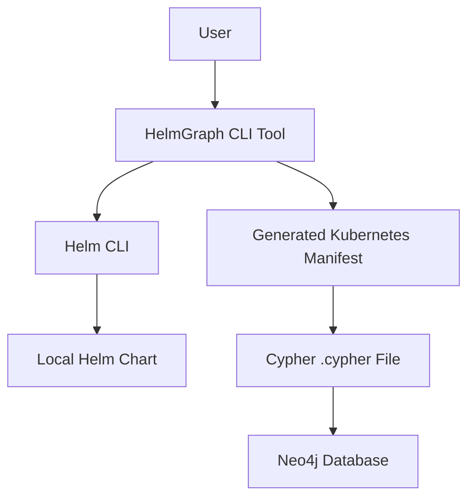
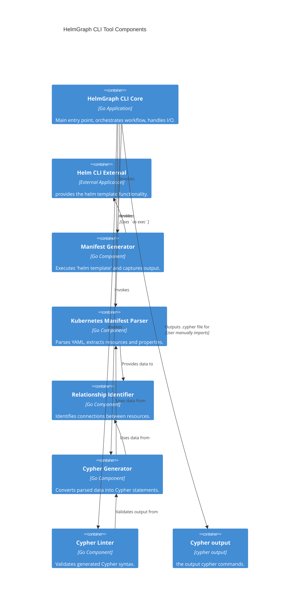
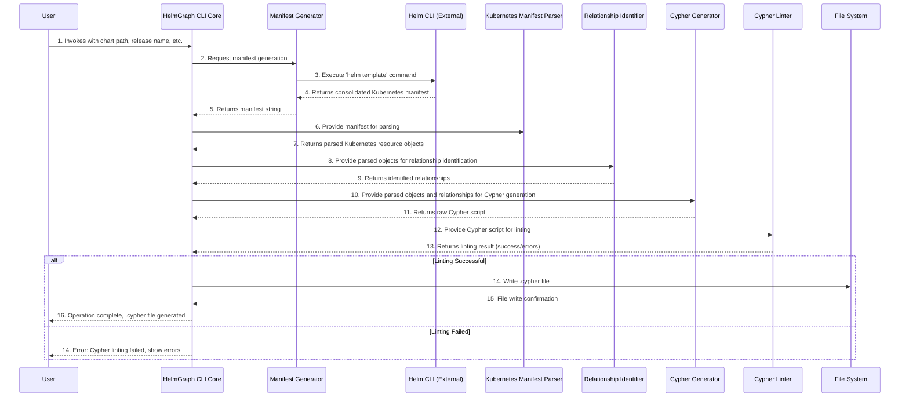

# helmgraph Architecture Document

## Introduction

This document outlines the overall project architecture for helmgraph, including backend systems, shared services, and non-UI specific concerns. Its primary goal is to serve as the guiding architectural blueprint for AI-driven development, ensuring consistency and adherence to chosen patterns and technologies.

**Relationship to Frontend Architecture:**
If the project includes a significant user interface, a separate Frontend Architecture Document will detail the frontend-specific design and MUST be used in conjunction with this document. Core technology stack choices documented herein (see "Tech Stack") are definitive for the entire project, including any frontend components.

### Starter Template or Existing Project

Before proceeding further with architecture design, check if the project is based on a starter template or existing codebase:

1. Review the PRD and brainstorming brief for any mentions of:
- Starter templates (e.g., Create React App, Next.js, Vue CLI, Angular CLI, etc.)
- Existing projects or codebases being used as a foundation
- Boilerplate projects or scaffolding tools
- Previous projects to be cloned or adapted

2. If a starter template or existing project is mentioned:
- Ask the user to provide access via one of these methods:
  - Link to the starter template documentation
  - Upload/attach the project files (for small projects)
  - Share a link to the project repository (GitHub, GitLab, etc.)
- Analyze the starter/existing project to understand:
  - Pre-configured technology stack and versions
  - Project structure and organization patterns
  - Built-in scripts and tooling
  - Existing architectural patterns and conventions
  - Any limitations or constraints imposed by the starter
- Use this analysis to inform and align your architecture decisions

3. If no starter template is mentioned but this is a greenfield project:
- Suggest appropriate starter templates based on the tech stack preferences
- Explain the benefits (faster setup, best practices, community support)
- Let the user decide whether to use one

4. If the user confirms no starter template will be used:
- Proceed with architecture design from scratch
- Note that manual setup will be required for all tooling and configuration

Document the decision here before proceeding with the architecture design. If none, just say N/A
N/A

### Change Log

| Date | Version | Description | Author |
|---|---|---|---|

## High Level Architecture

This section establishes the foundational architectural decisions for the `helmgraph` project, aligning with the product requirements for a command-line tool developed in Go.

### Technical Summary

The `helmgraph` system will be implemented as a **monolithic command-line tool** developed in **Go**. Its core function is to accept Helm chart inputs, process them to generate Kubernetes manifests, and then parse these manifests to produce Cypher queries for Neo4j. The architecture focuses on efficient local execution and direct output, without requiring its own persistent database. This design directly supports the project's goals of improving operational efficiency and enhancing understanding of Helm chart dependencies through graph visualization.

### High Level Overview

The primary architectural style for `helmgraph` will be a **Monolith**, implemented as a single, self-contained command-line application. The repository structure will be a **Monorepo**, as specified in the PRD, which will contain the Go source code and any related assets. The tool will execute `helm template` (either by invoking the CLI or using a Go-native Helm API if available) to generate Kubernetes manifests. It will then parse these manifests in-memory to identify resources and their relationships, finally outputting a `.cypher` file. Key architectural decisions include prioritizing **performance for local execution** (processing charts in under 30-60 seconds) and ensuring **minimal external dependencies** for the tool itself, aligning with its distribution as a standalone binary and Docker image.

### High Level Project Diagram



### Architectural and Design Patterns

Here are the key high-level patterns that will guide the `helmgraph` architecture, tailored for a monolithic Go CLI application:

-   **Monolithic Architecture:** The entire application is built as a single, indivisible unit.
    -   _Rationale:_ This aligns directly with the PRD's requirement for a monolithic service architecture. It simplifies development, deployment, and testing for an initial command-line tool, leveraging Go's strengths for single-binary distribution.

-   **Command-Line Interface (CLI) Pattern:** The application interacts with users primarily through text commands and arguments.
    -   _Rationale:_ This directly addresses NFR1 and NFR2, ensuring the tool is usable across Linux, macOS, and Windows (via WSL) and distributed as a binary. Go's robust ecosystem for CLI development (e.g., Cobra, spf13/viper) supports this.

-   **Parser Pattern:** The application will contain dedicated components responsible for interpreting and structuring input data (Kubernetes manifests).
    -   _Rationale:_ This is fundamental to FR3, enabling the tool to parse complex multi-document YAML streams from `helm template` output and extract relevant Kubernetes resource information for graph conversion.

-   **Builder Pattern (for Cypher):** The application will construct complex Cypher queries step-by-step.
    -   _Rationale:_ This will facilitate FR6 and FR7, ensuring the correct and valid generation of Cypher `CREATE`, `MERGE`, and `CONSTRAINT` statements, even for unknown or custom Kubernetes kinds.

## Tech Stack

This section is the **DEFINITIVE** technology selection for the `helmgraph` project. It's crucial that we make specific choices here, as these will guide all subsequent development.

I will present viable options for each category, make a recommendation based on the PRD and common best practices for Go CLI tools, and then seek your explicit approval for each selection. We will document exact versions to ensure consistency. This table will serve as the single source of truth for our technology choices.

Before we dive into the table, please be aware of the importance of these choices. We should look for any gaps or disagreements with anything I suggest, and I'm here to clarify anything that's unclear. If you're unsure about any category, I can provide suggestions with rationale.

Here are the key decisions we need to finalize:

*   **Languages and Runtimes:** The PRD specifies Go.
*   **Frameworks and Libraries / Packages:** We'll need to consider Go libraries for CLI parsing, YAML processing, and potentially a Helm SDK if we don't rely solely on the external `helm` CLI.
*   **Cloud provider and key services choices:** As a CLI tool, direct cloud services for its own operation are minimal, but we should consider if any external cloud services are implicitly needed (e.g., for fetching remote charts, though the PRD's explicitly state this for MVP).
*   **Database and storage solutions:** The PRD states the tool does not require a database for its own operation, but outputs to Neo4j.
*   **Development tools:** Standard Go development tools.

---

**Cloud Infrastructure**

-   **Provider:** N/A (CLI Tool)
-   **Key Services:** N/A (CLI Tool)
-   **Deployment Regions:** N/A (CLI Tool)

**Rationale:** As `helmgraph` is designed as a standalone command-line tool that does not require its own backend infrastructure or persistent storage for its operation (NFR5), direct cloud infrastructure is not applicable for the tool itself. Its output is consumed by an external Neo4j database.

---

**Technology Stack Table**

| Category | Technology | Version | Purpose | Rationale |
| :------- | :--------- | :------ | :------ | :-------- |
| **Language** | Go | 1.24.4 | Primary development language | NFR4 explicitly requires Go. It's well-suited for CLI tools, cross-platform compilation, and has a strong ecosystem for parsing and file operations. |
| **CLI Framework** | Cobra | v1.8.0 | Building robust command-line interfaces | Cobra is a popular and powerful library for creating modern CLI applications in Go, providing structure, argument parsing, and subcommands. |
| **YAML Parsing** | `gopkg.in/yaml.v3` | v3.0.1 | Parsing Kubernetes manifests (multi-document YAML) | This library is widely used and robust for handling complex YAML structures, including multi-document streams, which is essential for parsing `helm template` output (FR3). |
| **Helm Interaction** | `os/exec` (for `helm` CLI) | N/A | Executing external `helm` CLI commands | NFR7 states the tool requires the `helm` CLI. Using `os/exec` allows direct invocation of the external `helm` command for manifest generation (FR2). |
| **Graph Data Model** | Custom Go structs | N/A | Representing Kubernetes resources and relationships in-memory | A custom, lightweight Go struct model will be used to represent nodes and relationships before converting them to Cypher, ensuring flexibility and direct mapping to Cypher concepts. |
| **Cypher Generation** | Custom Go functions | N/A | Generating Cypher `CREATE`, `MERGE`, and `CONSTRAINT` statements | Given the specific nature of Cypher output (FR6, FR7), custom functions will provide precise control over syntax and property mapping, avoiding unnecessary dependencies. |
| **Linting** | `github.com/neilotoole/sq/libsq/ast/sqlparser` (or similar) | Latest stable | Linting generated Cypher output | FR8 requires linting the Cypher file. A Go-native SQL/Cypher parser/linter library will be investigated to ensure validity without external dependencies. |
| **Distribution** | Go build system | N/A | Creating standalone binaries and Docker images | Go's native build capabilities allow for easy cross-compilation to Linux, macOS, and Windows, and creating small Docker images, fulfilling NFR2 and NFR6. |

---

**Rationale for Tech Stack:**
The choices here are driven directly by the PRD's requirements (Go language, CLI tool, no internal database) and best practices for building performant and maintainable Go applications. Cobra provides a solid foundation for the CLI, `gopkg.in/yaml.v3` handles the complex YAML parsing, and `os/exec` integrates with the required external `helm` CLI. Custom Go structs and functions are chosen for graph data modeling and Cypher generation to maintain full control and minimize external dependencies. A Go-native linter will be sought for Cypher validation.

## Data Models

This section defines the core data models and entities that `helmgraph` will extract from Kubernetes manifests and represent as nodes and relationships in the Neo4j graph. These models are conceptual and will guide the in-memory representation before conversion to Cypher.

We will start with a generic Kubernetes Resource model, and then define specific examples based on the PRD.

---

**Purpose:** Represents any Kubernetes resource identified in the manifest. This serves as the base for all specific resource kinds.

**Key Attributes:**
- `kind`: String - The Kubernetes API `kind` of the resource (e.g., "Deployment", "Service").
- `name`: String - The `metadata.name` of the resource.
- `namespace`: String (Optional) - The `metadata.namespace` of the resource, if specified.

**Relationships:**
- Can have relationships like `SELECTS`, `USES_CONFIG`, `USES_SECRET`, etc., with other Kubernetes resources.

---

**Purpose:** Represents a Kubernetes `Deployment` resource.

**Key Attributes:**
- `kind`: String - "Deployment"
- `name`: String - The name of the Deployment.
- `namespace`: String (Optional) - The namespace of the Deployment.
- `labels`: Map (Optional) - Key-value pairs from `metadata.labels`, used for selectors.

**Relationships:**
- Can `USES_CONFIG` a `ConfigMap`.
- Can `USES_SECRET` a `Secret`.
- Can be `SELECTED_BY` a `Service`.

---

**Purpose:** Represents a Kubernetes `Service` resource.

**Key Attributes:**
- `kind`: String - "Service"
- `name`: String - The name of the Service.
- `namespace`: String (Optional) - The namespace of the Service.
- `selector`: Map (Optional) - Key-value pairs from `spec.selector`, used to select pods/deployments.

**Relationships:**
- Can `SELECTS` a `Deployment` (or other workload).

---

**Purpose:** Represents a Kubernetes `ConfigMap` resource.

**Key Attributes:**
- `kind`: String - "ConfigMap"
- `name`: String - The name of the ConfigMap.
- `namespace`: String (Optional) - The namespace of the ConfigMap.

**Relationships:**
- Can be `USED_BY` a `Deployment` (or other workload).

---

**Purpose:** Represents a Kubernetes `Secret` resource.

**Key Attributes:**
- `kind`: String - "Secret"
- `name`: String - The name of the Secret.
- `namespace`: String (Optional) - The namespace of the Secret.

**Relationships:**
- Can be `USED_BY` a `Deployment` (or other workload).

---

**Rationale for Data Models:**
These conceptual models are derived directly from FR3, FR4, FR5, Story 1.3, and Story 1.4 of the PRD. They define the essential attributes for each node type (`kind`, `name`, `namespace`) and the primary relationships that `helmgraph` needs to identify. The generic "Kubernetes Resource" allows for extensibility to other `kind`s as required by FR3. The attributes are chosen to directly map to properties in Neo4j nodes and relationships.

## Components

Based on the architectural patterns, tech stack, and data models defined above, this section identifies the major logical components of the `helmgraph` monolithic application and their responsibilities.

---

**HelmGraph CLI Core**

**Responsibility:** This is the main entry point of the application. It handles command-line argument parsing, orchestrates the overall workflow, and manages input/output operations. It will coordinate calls to the Manifest Generator, Parser, and Cypher Generator components.

**Key Interfaces:**
- Command-line arguments (chart path, values file, release name, namespace, output file)
- Standard input/output
- File system interactions (reading chart files, writing Cypher output)

**Dependencies:** Manifest Generator, Kubernetes Manifest Parser, Cypher Generator, Cypher Linter

**Technology Stack:** Go, Cobra (for CLI), `os/exec` (for `helm` CLI invocation)

---

**Manifest Generator**

**Responsibility:** Responsible for executing the `helm template` command and capturing its output as a consolidated Kubernetes manifest string. It handles error conditions related to `helm` CLI execution.

**Key Interfaces:**
- Input: Helm chart path, values file path, release name, namespace
- Output: Consolidated Kubernetes manifest string or error

**Dependencies:** `helm` CLI (external dependency invoked via `os/exec`)

**Technology Stack:** Go, `os/exec`

---

**Kubernetes Manifest Parser**

**Responsibility:** Parses the multi-document YAML output from the Manifest Generator, identifies Kubernetes resources, and extracts their `kind`, `metadata.name`, `metadata.namespace`, and relevant properties (e.g., labels, selectors, volume mounts, environment variables). It transforms this raw data into the defined in-memory data models.

**Key Interfaces:**
- Input: Consolidated Kubernetes manifest string
- Output: List of structured Kubernetes resource objects (Go structs)

**Dependencies:** `gopkg.in/yaml.v3`

**Technology Stack:** Go, `gopkg.in/yaml.v3`

---

**Relationship Identifier**

**Responsibility:** Analyzes the parsed Kubernetes resource objects to identify and establish relationships between them, such as `Service` to `Deployment` (via selectors) and `Deployment` to `ConfigMap`/`Secret` (via mounts/envFrom).

**Key Interfaces:**
- Input: List of structured Kubernetes resource objects
- Output: List of identified relationships (Go structs)

**Dependencies:** Kubernetes Manifest Parser (consumes its output)

**Technology Stack:** Go

---

**Cypher Generator**

**Responsibility:** Takes the structured Kubernetes resource objects (nodes) and identified relationships (edges) and converts them into valid Cypher `CREATE`, `MERGE`, and `CONSTRAINT` statements. It constructs the final `.cypher` file content.

**Key Interfaces:**
- Input: List of structured Kubernetes resource objects, List of identified relationships
- Output: String containing the complete Cypher script

**Dependencies:** Kubernetes Manifest Parser, Relationship Identifier

**Technology Stack:** Go (custom functions for string formatting)

---

**Cypher Linter**

**Responsibility:** Validates the syntactical correctness of the generated Cypher script before it is written to a file. This ensures the output is directly usable by Neo4j.

**Key Interfaces:**
- Input: String containing the Cypher script
- Output: Validation status (success/failure) and any linting errors

**Dependencies:** Cypher Generator (consumes its output), `github.com/neilotoole/sq/libsq/ast/sqlparser` (or similar Go library)

**Technology Stack:** Go, Go Cypher/SQL parsing library

---

**Component Diagrams**

I will create a Mermaid diagram to visualize the component relationships. A C4 Container diagram would be appropriate for this high-level view of the monolithic application's internal components.



---

**Rationale for Components:**
This breakdown defines the logical separation of concerns within the `helmgraph` monolithic application. Each component has a clear responsibility, contributing to the overall process of converting Helm charts to Cypher. The dependencies between components are explicitly stated, and the C4 Container diagram provides a visual representation of how these internal components interact, as well as their interaction with external systems like the `helm` CLI and Neo4j. This structure promotes modularity and testability within the monolithic design.

## External APIs

Based on the `helmgraph` Product Requirements Document (PRD), this project is a command-line tool that outputs a Cypher file. It does not require any external API integrations for its own operation, beyond potentially invoking the local `helm` CLI. The PRD explicitly states that the tool only reads local files and does not transmit any data.

Therefore, this section is not applicable to the current scope of the `helmgraph` project.

---

**Rationale:**
This section is skipped because the PRD clearly defines `helmgraph` as a standalone CLI tool with no external API dependencies for its core functionality.

## Core Workflows

This section illustrates the key system workflows using sequence diagrams, focusing on the critical user journey of converting a Helm chart to a Cypher script.



---

**Rationale for Core Workflows:**
This sequence diagram visualizes the end-to-end process of `helmgraph`, from user invocation to Cypher file output. It clearly shows the interaction flow between the main CLI component and its internal sub-components, as well as the interaction with the external `helm` CLI. The inclusion of the Cypher Linter step and its conditional success/failure path highlights the importance of FR8 (linting the Cypher file) in the overall workflow. This diagram clarifies the operational sequence and dependencies within the monolithic application.

## Database Schema

This section defines how the conceptual data models will be transformed into concrete database schemas. Given that `helmgraph` is a command-line tool that outputs Cypher queries for Neo4j (NFR5, NFR8), it does not maintain its own internal database. Therefore, this section will focus on the **structure of the Cypher output** that is intended for a Neo4j graph database.

The Cypher output will define nodes and relationships based on the Kubernetes resources and their connections identified in the manifest.

**Node Definitions (Cypher Labels and Properties):**

*   **Generic Kubernetes Resource Node:**
    ```cypher
    (:KubernetesResource {kind: "...", name: "...", namespace: "..."})
    ```
    *   **Rationale:** This generic label allows for flexible representation of all Kubernetes `kind`s as required by FR3, even those not explicitly known in advance.

*   **Specific Resource Nodes (Examples):**
    *   **Deployment:**
        ```cypher
        (:Deployment:KubernetesResource {kind: "Deployment", name: "my-app-deployment", namespace: "default", labels: {app: "my-app"}})
        ```
    *   **Service:**
        ```cypher
        (:Service:KubernetesResource {kind: "Service", name: "my-app-service", namespace: "default", selector: {app: "my-app"}})
        ```
    *   **ConfigMap:**
        ```cypher
        (:ConfigMap:KubernetesResource {kind: "ConfigMap", name: "my-app-config", namespace: "default"})
        ```
    *   **Secret:**
        ```cypher
        (:Secret:KubernetesResource {kind: "Secret", name: "my-app-secret", namespace: "default"})
        ```
    *   **Rationale:** Specific labels (e.g., `:Deployment`, `:Service`) provide more granular typing in Neo4j, allowing for more precise queries and visualizations. All specific resource nodes will also carry the `:KubernetesResource` label for broader queries.

**Relationship Definitions (Cypher Types and Properties):**

*   **Service to Deployment (SELECTS):**
    ```cypher
    (:Service)-[:SELECTS {selector_labels: {app: "my-app"}}]->(:Deployment)
    ```
    *   **Rationale:** Directly implements Story 1.3, showing how a Service routes traffic to a Deployment based on selectors.

*   **Deployment to ConfigMap (USES_CONFIG):**
    ```cypher
    (:Deployment)-[:USES_CONFIG {mount_path: "/etc/config", env_var_name: "CONFIG_FILE"}]->(:ConfigMap)
    ```
    *   **Rationale:** Directly implements Story 1.4, showing a Deployment's dependency on a ConfigMap. Properties like `mount_path` or `env_var_name` provide context.

*   **Deployment to Secret (USES_SECRET):**
    ```cypher
    (:Deployment)-[:USES_SECRET {mount_path: "/etc/secrets", env_var_name: "DB_PASSWORD"}]->(:Secret)
    ```
    *   **Rationale:** Directly implements Story 1.4, showing a Deployment's dependency on a Secret. Properties like `mount_path` or `env_var_name` provide context.

**Constraint Statements (FR7):**

The generated `.cypher` file will include `CREATE CONSTRAINT` statements to ensure data integrity and optimize query performance in Neo4j. Examples:

```cypher
CREATE CONSTRAINT IF NOT EXISTS FOR (n:KubernetesResource) REQUIRE (n.kind, n.name, n.namespace) IS UNIQUE;
CREATE CONSTRAINT IF NOT EXISTS FOR (n:Deployment) REQUIRE (n.name, n.namespace) IS UNIQUE;
CREATE CONSTRAINT IF NOT EXISTS FOR (n:Service) REQUIRE (n.name, n.namespace) IS UNIQUE;
CREATE CONSTRAINT IF NOT EXISTS FOR (n:ConfigMap) REQUIRE (n.name, n.namespace) IS UNIQUE;
CREATE CONSTRAINT IF NOT EXISTS FOR (n:Secret) REQUIRE (n.name, n.namespace) IS UNIQUE;
```
*   **Rationale:** These constraints enforce uniqueness for key node properties, which is crucial for `MERGE` operations and efficient graph traversal in Neo4j.

---

**Rationale for Database Schema:**
This section clarifies the structure of the Cypher output, which serves as the "database schema" for the external Neo4j instance. It directly maps the conceptual data models to concrete Cypher syntax for nodes, relationships, and constraints, fulfilling FR6, FR7, Story 1.5, and the overall goal of generating a usable graph representation. The examples provided illustrate how different Kubernetes resource types and their connections will be translated into graph elements.

## Source Tree

This section defines the proposed project folder structure for `helmgraph`. This structure reflects the chosen monolithic Go application architecture within a monorepo, adhering to Go's standard project layout conventions and ensuring clear separation of concerns.

```plaintext
helmgraph/
├── cmd/
│   └── helmgraph/            # Main application entry point
│       └── main.go           # CLI initialization and command handling
├── internal/
│   ├── manifest/             # Logic for generating Kubernetes manifests
│   │   └── generator.go      # Handles 'helm template' execution
│   ├── parser/               # Logic for parsing Kubernetes manifests
│   │   ├── parser.go         # Core parsing logic
│   │   └── models.go         # Go structs for Kubernetes resource representation
│   ├── relations/            # Logic for identifying relationships between resources
│   │   └── identifier.go     # Contains relationship identification rules
│   ├── cypher/               # Logic for generating Cypher statements
│   │   ├── generator.go      # Converts Go structs to Cypher strings
│   │   └── linter.go         # Cypher syntax validation
│   └── app/                  # Core application logic, orchestrating components
│       └── app.go            # Main application orchestrator
├── pkg/                      # Reusable packages (if any, currently none planned for MVP)
├── test/
│   ├── unit/                 # Unit tests for internal packages
│   ├── integration/          # Integration tests for component interactions
│   └── e2e/                  # End-to-end tests for the CLI tool
├── docs/                     # Project documentation (PRD, Architecture, etc.)
│   ├── prd.md
│   └── architecture.md
├── scripts/                  # Build, test, and utility scripts
├── .github/
│   └── workflows/            # GitHub Actions CI/CD workflows
├── go.mod                    # Go module definition
├── go.sum                    # Go module checksums
├── LICENSE
└── README.md
```

---

**Rationale for Source Tree:**
This source tree structure follows standard Go project layout recommendations, particularly the use of `cmd/` for main executables and `internal/` for application-specific private packages. This promotes modularity and prevents accidental import of internal packages by external projects. The separation of `manifest`, `parser`, `relations`, and `cypher` within `internal/` directly maps to the logical components defined earlier, ensuring a clear separation of concerns. The `test/` directory is structured to accommodate unit, integration, and end-to-end tests, aligning with the PRD's testing requirements. This layout is designed to be maintainable, scalable for future features, and idiomatic for Go development.

## Infrastructure and Deployment

This section defines the deployment architecture and practices for `helmgraph`. As a command-line tool distributed as a binary and Docker image, its deployment strategy is focused on distribution and local execution rather than continuous hosting.

---

**Infrastructure as Code**

-   **Tool:** N/A
-   **Location:** N/A
-   **Approach:** N/A

**Rationale:** Since `helmgraph` is a standalone CLI tool and does not require its own hosted infrastructure (NFR5), Infrastructure as Code (IaC) tools are not directly applicable for managing its operational environment. IaC would be relevant for the Neo4j database that consumes `helmgraph`'s output, but that is external to this project's scope.

---

**Deployment Strategy**

-   **Strategy:** Binary Distribution / Docker Image Distribution
-   **CI/CD Platform:** GitHub Actions (Recommended)
-   **Pipeline Configuration:** `.github/workflows/build-and-release.yaml` (Proposed)

**Rationale:** The primary deployment strategy aligns with NFR6, distributing `helmgraph` as a standalone binary for various operating systems (NFR2) and as a Docker image. GitHub Actions is a recommended CI/CD platform due to its integration with GitHub repositories, ease of use, and capabilities for cross-platform compilation and Docker image building. A dedicated workflow will automate the build, test, and release process.

---

**Environments**

-   **Development:** Local developer machines - For active coding, testing, and debugging.
-   **CI/CD:** GitHub Actions Runners - For automated builds, tests, and release artifact generation.
-   **User Machines:** End-user environments (Linux, macOS, Windows/WSL) - Where the binary or Docker image is downloaded and executed.

**Rationale:** Given `helmgraph`'s nature as a CLI tool, traditional "environments" like staging or production servers are not applicable for its own hosting. Instead, environments refer to where the tool is developed, built, and ultimately consumed by users.

---

**Environment Promotion Flow**

```text
Developer Machine (Code)
    ↓
GitHub (Push)
    ↓
GitHub Actions (Build, Test, Lint)
    ↓ (On successful build/test)
GitHub Releases (Binary & Docker Image Artifacts)
    ↓
User Machines (Download & Execute)
```

**Rationale:** This flow outlines a simple, direct path from code development to user consumption. Changes are pushed to GitHub, automated CI/CD pipelines build and test the application, and upon success, release artifacts (binaries, Docker images) are published to GitHub Releases, from where users can download and run the tool.

---

**Rollback Strategy**

-   **Primary Method:** Download previous release version
-   **Trigger Conditions:** Critical bug discovered in new release, unexpected behavior, performance degradation.
-   **Recovery Time Objective:** Minutes (dependent on user's download speed and execution time)

**Rationale:** For a CLI tool, rollback is straightforward: users simply download and replace the problematic version with a previous stable release from GitHub Releases. This is a quick and effective method, as there is no complex server-side infrastructure to manage.

---

**Rationale for Infrastructure and Deployment:**
This section details how `helmgraph` will be built, released, and consumed, aligning with its identity as a standalone CLI tool. The focus is on efficient distribution and ease of use for the end-user, rather than complex server deployments. GitHub Actions is proposed as the CI/CD backbone to automate the release process, ensuring consistent and reliable delivery of the tool.

## Error Handling Strategy

This section defines the comprehensive error handling approach for `helmgraph`. Given that `helmgraph` is a command-line tool, the strategy will focus on providing clear, actionable error messages to the user, robust internal error management, and effective logging for debugging.

---

**General Approach**

-   **Error Model:** Go's idiomatic error handling will be used, returning `error` as the last return value from functions. Custom error types will be defined for specific, recoverable, or categorizable errors.
-   **Exception Hierarchy:** Go does not have exceptions in the traditional sense. Errors will be propagated up the call stack using `return err` until they can be handled appropriately (e.g., logged, presented to the user).
-   **Error Propagation:** Errors will be propagated with context using `fmt.Errorf` and `errors.Wrap` (if using a wrapping library like `pkg/errors` or Go 1.13+ `errors.Is`/`errors.As` for error chaining) to provide a clear trail of where the error originated and what caused it.

**Rationale:** Adhering to Go's native error handling patterns ensures consistency and readability. Propagating errors with context is crucial for debugging a CLI tool, allowing developers to understand the full chain of events leading to an issue.

---

**Logging Standards**

-   **Library:** `log` (Go standard library) or `logrus` / `zap` (for more advanced features)
-   **Format:** Structured logging (e.g., JSON) for machine readability, plain text for console output.
-   **Levels:** `DEBUG`, `INFO`, `WARN`, `ERROR`, `FATAL`.
-   **Required Context:**
    -   Correlation ID: N/A (single-process CLI tool, no distributed tracing needed for MVP)
    -   Service Context: Component/module name (e.g., `[parser]`, `[cypher-generator]`)
    -   User Context: Input parameters (e.g., chart path, release name - sanitized to avoid sensitive data)

**Rationale:** While `helmgraph` is a CLI tool, structured logging is beneficial for debugging, especially if logs are ever redirected to a file or a log aggregation system. Clear logging levels help in filtering output based on verbosity. Including component context helps pinpoint the source of issues.

---

**Error Handling Patterns**

#### External CLI Errors (e.g., `helm` CLI)

-   **Retry Policy:** No automatic retries for `helm` CLI invocation. Fail fast and report the error.
-   **Circuit Breaker:** Not applicable for a single, synchronous CLI invocation.
-   **Timeout Configuration:** A reasonable timeout will be applied to the `helm template` command execution to prevent indefinite hangs (e.g., 5 minutes).
-   **Error Translation:** `helm` CLI errors will be captured (stderr) and translated into user-friendly messages, indicating issues like invalid chart paths, missing `helm` executable, or template rendering failures.

**Rationale:** For external CLI dependencies, direct error reporting is preferred. Timeouts prevent unresponsive behavior. Translating raw CLI errors into understandable messages is critical for a good user experience.

#### Business Logic Errors (e.g., Parsing, Relationship Identification)

-   **Custom Exceptions:** Custom error types will be defined for specific business logic failures, such as `ErrInvalidManifest`, `ErrResourceNotFound`, `ErrRelationshipNotIdentified`.
-   **User-Facing Errors:** Errors presented to the user will be concise, clear, and actionable, guiding them on how to resolve the issue (e.g., "Error: Invalid Helm chart path. Please check the path and try again.").
-   **Error Codes:** Simple, internal error codes or enumerated error types can be used for programmatic identification of error categories, but not exposed directly to the user.

**Rationale:** Custom error types allow for more precise error handling and testing. User-facing errors must be helpful, not just technical dumps.

#### Data Consistency (Internal)

-   **Transaction Strategy:** Not applicable, as `helmgraph` does not manage its own persistent data or transactions. All operations are in-memory and atomic for a single execution.
-   **Compensation Logic:** Not applicable. If an error occurs during processing, the tool will stop and report the error; no partial state needs to be rolled back.
-   **Idempotency:** The `helmgraph` execution itself is idempotent in terms of its output for a given input. Running it multiple times with the same input will produce the same `.cypher` file.

**Rationale:** This section clarifies that traditional database-centric data consistency patterns are not relevant for `helmgraph` due to its stateless, CLI nature.

---

**Rationale for Error Handling Strategy:**
This strategy is tailored for a Go-based command-line tool. It emphasizes Go's idiomatic error handling, clear user feedback, and robust internal logging. Specific patterns are defined for interacting with external CLIs and handling internal business logic errors. The non-applicability of certain patterns (like transactions or retries) is explicitly stated, aligning with the tool's design. This ensures that `helmgraph` will be resilient, debuggable, and user-friendly when issues arise.

## Coding Standards

These standards are **MANDATORY** for AI agents (and human developers). We need to define only the critical rules needed to prevent bad code. It's important to understand that:

1.  This section directly controls AI developer behavior.
2.  We should keep it minimal – assume AI knows general best practices.
3.  Focus on project-specific conventions and "gotchas."
4.  Overly detailed standards bloat context and slow development.
5.  These standards will be extracted to a separate file for the dev agent's direct use.

For each standard, I will seek your explicit confirmation that it's necessary.

---

**Core Standards**

-   **Languages & Runtimes:** Go 1.24.4
    -   **Detail:** We are standardizing on Go version 1.24.4. This version provides the most up-to-date language features, performance improvements, and security patches. It aligns with the PRD's explicit requirement for Go (NFR4) and ensures we leverage the latest advancements in the Go ecosystem for building a robust and efficient CLI tool. Pinning to a specific major.minor version (e.g., 1.24.4) helps ensure build reproducibility across different development environments and CI/CD pipelines.

-   **Style & Linting:**
    -   `gofmt`: **Mandatory** for code formatting.
        -   **Detail:** `gofmt` is the official Go formatting tool. It automatically formats Go source code according to the standard Go style. Its use is non-negotiable to ensure absolute consistency in code style across the entire project, regardless of who (or what AI agent) writes the code. This eliminates style debates and makes code reviews more efficient.
    -   `golint`: For stylistic checks.
        -   **Detail:** `golint` checks for stylistic errors in Go source code, such as naming conventions (e.g., exported names should have comments), unexported struct fields, and other common Go idioms. While some of its checks might be superseded by `staticcheck`, it still provides valuable feedback on code readability and adherence to Go's idiomatic style.
    -   `staticcheck`: Comprehensive static analysis for Go code.
        -   **Detail:** `staticcheck` is a powerful static analysis tool that detects various kinds of bugs and suspicious constructs in Go code. It includes checks for unused code, inefficient operations, potential panics, and more. This tool is critical for catching subtle bugs early in the development cycle and ensuring high code quality and performance.
    -   `go vet`: Standard Go tool for suspicious constructs.
        -   **Detail:** `go vet` is a built-in Go tool that examines Go source code and reports suspicious constructs, suchs as unreachable code, incorrect format string usage, and common concurrency issues. It acts as a first line of defense for identifying potential runtime problems before they manifest.

-   **Test Organization:**
    -   Unit tests: `_test.go` files in the same package as the code they test.
        -   **Detail:** This is the standard Go convention. For example, `internal/parser/parser.go` would have its unit tests in `internal/parser/parser_test.go`. This co-location makes it easy to find tests for a given piece of code and ensures that tests can access unexported functions/types within the same package.
    -   Integration tests: `_test.go` files in a separate `test/integration` directory, or within the package but clearly separated (e.g., `integration_test.go`).
        -   **Detail:** Integration tests verify the interaction between multiple components or external dependencies (like the `helm` CLI). If they are tightly coupled to a specific package, they can reside in that package (e.g., `internal/manifest/generator_integration_test.go`). Otherwise, for broader integration scenarios, they will be placed in `test/integration/`. This separation helps distinguish between isolated unit tests and tests that require more setup or external resources.
    -   E2E tests: Located in `test/e2e`.
        -   **Detail:** End-to-end tests validate the entire `helmgraph` CLI tool from user invocation to final output. These tests will simulate real user scenarios and verify the complete workflow. Placing them in `test/e2e/` provides a clear, high-level testing suite that confirms the overall functionality of the built binary or Docker image.

---

**Rationale for Core Standards (Expanded):**
This expanded rationale provides a deeper understanding of *why* each standard is chosen and *how* it contributes to the overall quality and maintainability of the `helmgraph` codebase. By detailing the purpose of each linter and the rationale behind test organization, we ensure that both AI agents and human developers have a clear and consistent understanding of the project's coding expectations. These standards are designed to enforce Go idioms, catch common errors, and streamline the development and review process.

### Naming Conventions

| Element | Convention | Example |
|---|---|---|

### Critical Rules

### Language-Specific Guidelines

This section is intended for **highly specific Go rules** that are critical for preventing AI (or human) developers from making common or project-specific mistakes that are not covered by general Go best practices or the linters mentioned above.

**Rationale:**
Most Go projects do not need this section. Go's strong conventions and the effectiveness of tools like `gofmt`, `golint`, and `staticcheck` cover the vast majority of coding standards. Adding rules here should be done **only if absolutely critical** for `helmgraph` to prevent specific, recurring issues or to enforce a very particular project-level idiom that deviates from common Go patterns. Overly detailed rules here can add unnecessary context and slow down development.

If we do add rules here, they should be concise and actionable.

Here's the template for this section:

#### {{language_name}} Specifics

-   **{{rule_topic}}:** {{rule_detail}}

**Example (if we were to add one, but generally avoid unless critical):**
-   **Error Handling:** Always wrap errors with `fmt.Errorf("...: %w", err)` when propagating, to preserve the original error chain for debugging.

---

**Rationale for Language-Specific Guidelines (Expanded):**
This section is a last resort for very specific, critical Go-related rules. The emphasis is on avoiding redundancy with existing Go tooling and general best practices. Its purpose is to address unique `helmgraph` project requirements or to explicitly prevent known pitfalls that the AI might otherwise introduce. We should only populate this if there's a clear, demonstrated need.

## Test Strategy and Standards

## Security

## Checklist Results Report

## Next Steps

### Architect Prompt