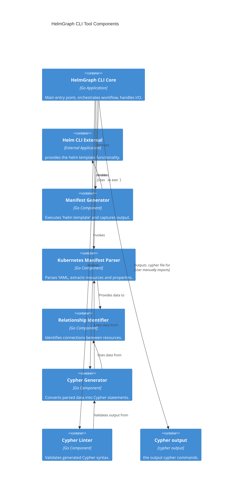

# Components

Based on the architectural patterns, tech stack, and data models defined above, this section identifies the major
logical components of the `helmgraph` monolithic application and their responsibilities.

---

**HelmGraph CLI Core**

**Responsibility:** This is the main entry point of the application. It handles command-line argument parsing,
orchestrates the overall workflow, and manages input/output operations. It will coordinate calls to the Manifest
Generator, Parser, and Cypher Generator components.

**Key Interfaces:**
- Command-line arguments (chart path, values file, release name, namespace, output file)
- Standard input/output
- File system interactions (reading chart files, writing Cypher output)

**Dependencies:** Manifest Generator, Kubernetes Manifest Parser, Cypher Generator, Cypher Linter

**Technology Stack:** Go, Cobra (for CLI), `os/exec` (for `helm` CLI invocation)

---

**Manifest Generator**

**Responsibility:** Responsible for executing the `helm template` command and capturing its output as a consolidated
Kubernetes manifest string. It handles error conditions related to `helm` CLI execution.

**Key Interfaces:**
- Input: Helm chart path, values file path, release name, namespace
- Output: Consolidated Kubernetes manifest string or error

**Dependencies:** `helm` CLI (external dependency invoked via `os/exec`)

**Technology Stack:** Go, `os/exec`

---

**Kubernetes Manifest Parser**

**Responsibility:** Parses the multi-document YAML output from the Manifest Generator, identifies Kubernetes resources,
and extracts their `kind`, `metadata.name`, `metadata.namespace`, and relevant properties (e.g., labels, selectors,
volume mounts, environment variables). It transforms this raw data into the defined in-memory data models.

**Key Interfaces:**
- Input: Consolidated Kubernetes manifest string
- Output: List of structured Kubernetes resource objects (Go structs)

**Dependencies:** `gopkg.in/yaml.v3`

**Technology Stack:** Go, `gopkg.in/yaml.v3`

---

**Relationship Identifier**

**Responsibility:** Analyzes the parsed Kubernetes resource objects to identify and establish relationships between
them, such as `Service` to `Deployment` (via selectors) and `Deployment` to `ConfigMap`/`Secret` (via mounts/envFrom).

**Key Interfaces:**
- Input: List of structured Kubernetes resource objects
- Output: List of identified relationships (Go structs)

**Dependencies:** Kubernetes Manifest Parser (consumes its output)

**Technology Stack:** Go

---

**Cypher Generator**

**Responsibility:** Takes the structured Kubernetes resource objects (nodes) and identified relationships (edges) and
converts them into valid Cypher `CREATE`, `MERGE`, and `CONSTRAINT` statements. It constructs the final `.cypher` file
content.

**Key Interfaces:**
- Input: List of structured Kubernetes resource objects, List of identified relationships
- Output: String containing the complete Cypher script

**Dependencies:** Kubernetes Manifest Parser, Relationship Identifier

**Technology Stack:** Go (custom functions for string formatting)

---

**Cypher Linter**

**Responsibility:** Validates the syntactical correctness of the generated Cypher script before it is written to a file.
This ensures the output is directly usable by Neo4j.

**Key Interfaces:**
- Input: String containing the Cypher script
- Output: Validation status (success/failure) and any linting errors

**Dependencies:** Cypher Generator (consumes its output), `github.com/neilotoole/sq/libsq/ast/sqlparser` (or similar Go
library)

**Technology Stack:** Go, Go Cypher/SQL parsing library

---

**Component Diagrams**

I will create a Mermaid diagram to visualize the component relationships. A C4 Container diagram would be appropriate for
this high-level view of the monolithic application's internal components.

---

**Rationale for Components:**
This breakdown defines the logical separation of concerns within the `helmgraph` monolithic application. Each component
has a clear responsibility, contributing to the overall process of converting Helm charts to Cypher. The dependencies
between components are explicitly stated, and the C4 Container diagram provides a visual representation of how these
internal components interact, as well as their interaction with external systems like the `helm` CLI and Neo4j. This
structure promotes modularity and testability within the monolithic design.
