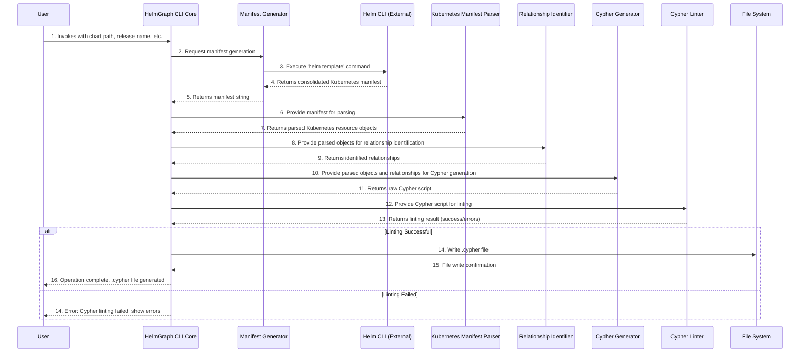

# Core Workflows

This section illustrates the key system workflows using sequence diagrams, focusing on the critical user journey of
converting a Helm chart to a Cypher script.

---

**Rationale for Core Workflows:**
This sequence diagram visualizes the end-to-end process of `helmgraph`, from user invocation to Cypher file output. It
clearly shows the interaction flow between the main CLI component and its internal sub-components, as well as the
interaction with the external `helm` CLI. The inclusion of the Cypher Linter step and its conditional success/failure
path highlights the importance of FR8 (linting the Cypher file) in the overall workflow. This diagram clarifies the
operational sequence and dependencies within the monolithic application.
