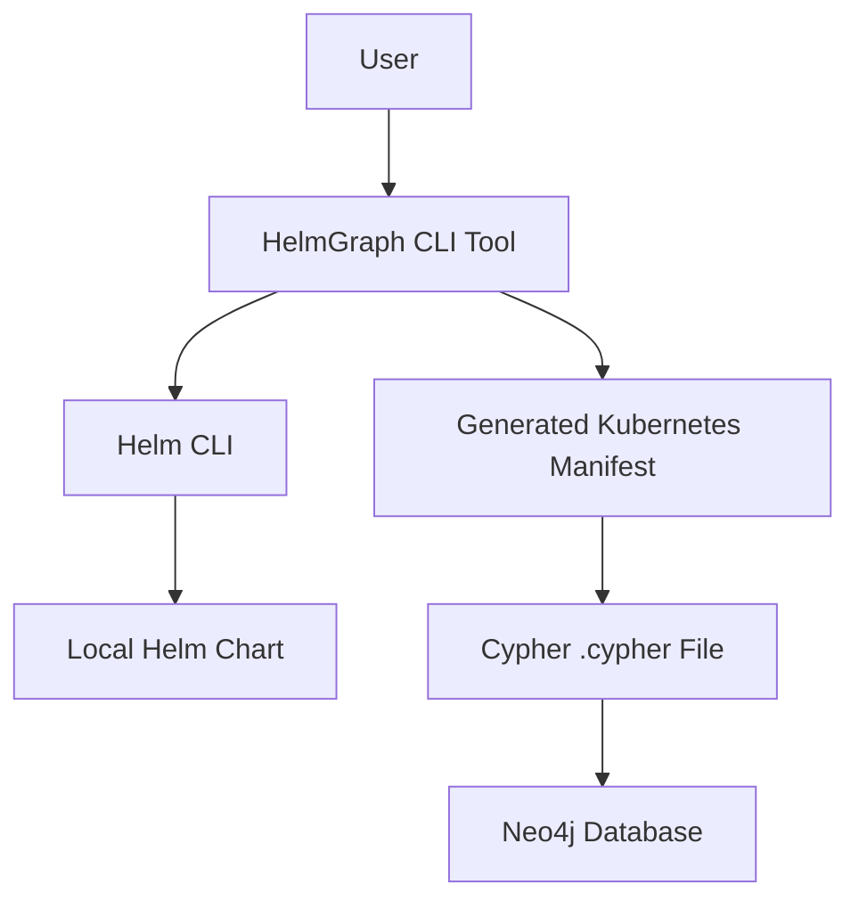

# High Level Architecture

This section establishes the foundational architectural decisions for the `helmgraph` project, aligning with the product
requirements for a command-line tool developed in Go.

### Technical Summary

The `helmgraph` system will be implemented as a **monolithic command-line tool** developed in **Go**. Its core function
is to accept Helm chart inputs, process them to generate Kubernetes manifests, and then parse these manifests to
produce Cypher queries for Neo4j. The architecture focuses on efficient local execution and direct output, without
requiring its own persistent database. This design directly supports the project's goals of improving operational
efficiency and enhancing understanding of Helm chart dependencies through graph visualization.

### High Level Overview

The primary architectural style for `helmgraph` will be a **Monolith**, implemented as a single, self-contained
command-line application. The repository structure will be a **Monorepo**, as specified in the PRD, which will contain
the Go source code and any related assets. The tool will execute `helm template` (either by invoking the CLI or using a
Go-native Helm API if available) to generate Kubernetes manifests. It will then parse these manifests in-memory to
identify resources and their relationships, finally outputting a `.cypher` file. Key architectural decisions include
prioritizing **performance for local execution** (processing charts in under 30-60 seconds) and ensuring **minimal
external dependencies** for the tool itself, aligning with its distribution as a standalone binary and Docker image.

### High Level Project Diagram

### Architectural and Design Patterns

Here are the key high-level patterns that will guide the `helmgraph` architecture, tailored for a monolithic Go CLI
application:

-   **Monolithic Architecture:** The entire application is built as a single, indivisible unit.
    -   _Rationale:_ This aligns directly with the PRD's requirement for a monolithic service architecture. It
        simplifies development, deployment, and testing for an initial command-line tool, leveraging Go's strengths for
        single-binary distribution.

-   **Command-Line Interface (CLI) Pattern:** The application interacts with users primarily through text commands and
    arguments.
    -   _Rationale:_ This directly addresses NFR1 and NFR2, ensuring the tool is usable across Linux, macOS, and
        Windows (via WSL) and distributed as a binary. Go's robust ecosystem for CLI development (e.g., Cobra,
        spf13/viper) supports this.

-   **Parser Pattern:** The application will contain dedicated components responsible for interpreting and structuring
    input data (Kubernetes manifests).
    -   _Rationale:_ This is fundamental to FR3, enabling the tool to parse complex multi-document YAML streams from
        `helm template` output and extract relevant Kubernetes resource information for graph conversion.

-   **Builder Pattern (for Cypher):** The application will construct complex Cypher queries step-by-step.
    -   _Rationale:_ This will facilitate FR6 and FR7, ensuring the correct and valid generation of Cypher `CREATE`,
        `MERGE`, and `CONSTRAINT` statements, even for unknown or custom Kubernetes kinds.
